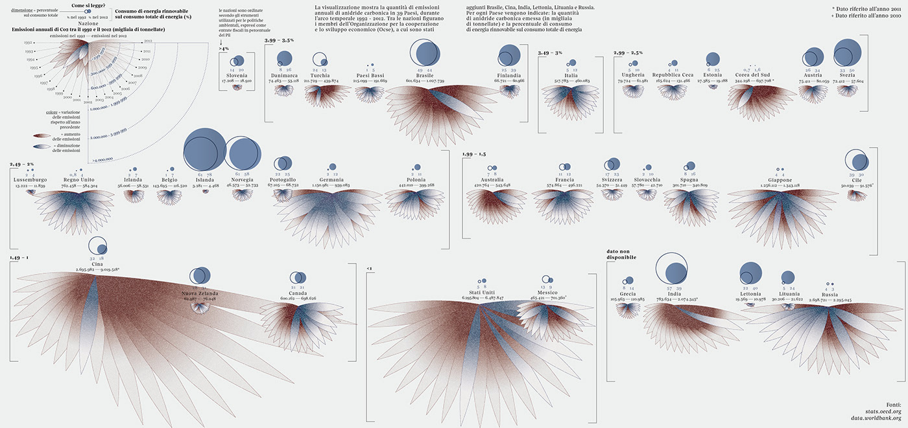

# TIME SERIES: CLIMATE CHANGE

### TLDR  
* Visualize time-series data about climate change using `chart.js`  
* [For March 1](Part1-ResearchAndFindingData.md): project setup, find data you'd like to work with, read *asdf*    
* For March 8: design variations, read [*Continue, Pivot, or Put It Down*](https://pudding.cool/process/pivot-continue-down)  
* For March 15: finish project  

⚠️ Since this is a multi-week project, details for each week are in separate files! Links in the `TLDR` section above ⚠️ 

### ASSIGNMENT
> “There is no way to think up an original and extraordinary design — it can only come as a result of pursuing a given task. In the same way running down a list of words is different from making a narrative.” – [Artemy Lebedev](https://www.artlebedev.com/mandership/162)    

This project is the first of two assignments that dig deep into complex social and political issues. Climate change has gone from a [fragmented set of ideas in the 1800s](https://history.aip.org/climate/timeline.htm) to a [hotly-contested scientific theory](https://theconversation.com/30-years-ago-global-warming-became-front-page-news-and-both-republicans-and-democrats-took-it-seriously-97658) in the 20th century and now is considered an [agreed-upon fact by more than 97% of actively publishing climate scientists](https://climate.nasa.gov/scientific-consensus). The goal of this assignment is not to prove climate change is real, nor is it to try to show all the evidence or impacts a warming Earth will have: that would be an impossible task! Instead, in this project you will do exploratory research, find interesting time-based data, and create a refined visualization using `chart.js` that tells part of the complex story of climate change.

Your project will have a few key components:  
* Use [time-series](https://en.wikipedia.org/wiki/Time_series) data related to climate change (see also [*What About Maps?*](#what-about-maps) below)  
* A single visualization made with `chart.js` that you have refined  
* A published dataset with citation to the original source(s)  

*Above: a really beautiful infographic of carbon dioxide emissions by Federica Fragapane ([detail images here](https://www.behance.net/gallery/31279439/Carbon-Dioxide-Emissions))*

### INSPIRATION  
* [*#ShowYourStripes*](https://showyourstripes.info/) by Ed Hawkins (see also [this interesting article](https://www.cbsnews.com/news/climate-change-2000-years-of-earths-temperatures-in-one-simple-chart-and-copycat-misinformation) on the project and misleading knockoffs)  
* [*Every Country Has Its Own Climate Risks. What's Yours?*](https://www.nytimes.com/interactive/2021/01/28/opinion/climate-change-risks-by-country.html) from the New York Times  
* [*United States of Climate Change*](https://features.weather.com/us-climate-change/minnesota/) by Chris Dolce and Rebecca Pollack (The Weather Channel)  
* [*2ºC: Beyong the Limit*](https://www.washingtonpost.com/graphics/2019/national/climate-environment/climate-change-america/) by Steven Mufson, Chris Mooney, Juliet Eilperin, and John Muyskens (Washington Post)  
* [*Visualizing the Warmest August in 136 Years*](https://earthobservatory.nasa.gov/blogs/earthmatters/2016/09/12/heres-how-the-warmest-august-in-136-years-looks-in-chart-form/) by Leslie McCarthy and Michael Cabbage (NASA Earth Observatory)  
* [*A Checkup for Carbon*](https://earthobservatory.nasa.gov/blogs/earthmatters/category/climate/) by Adam Voiland (NASA Earth Observatory)  
* [*A Timeline of Earth's Average Temperature*](https://xkcd.com/1732/) by xkcd  
* A [fascinating project using a satellite to accurately measure sea levels](https://www.jpl.nasa.gov/news/nasa-us-and-european-partner-satellite-returns-first-sea-level-measurements) from NASA's Jet Propulsion Laboratory  
* [*What's Really Warming the World?*](https://www.bloomberg.com/graphics/2015-whats-warming-the-world/) by Eric Roston and Blacki Migliozzi (Bloomberg Businessweek)  
* [*Cape Cod Coastline Change*](https://earthobservatory.nasa.gov/world-of-change/CapeCod) from NASA Earth Observatory (part of their [*World of Change*](https://earthobservatory.nasa.gov/world-of-change) project)  
* [*Climate Change: Featured Indicators*](https://data.worldbank.org/topic/climate-change) from The World Bank  
* [*CO2 Emissions vs Vulnerability to Climate Change, by Nation*](https://onlinepublichealth.gwu.edu/resources/climate-change-emissions-data/) from Milken Institute School of Public Health (George Washington University)  
* [*Carbon Dioxide Emissions*](https://www.behance.net/gallery/31279439/Carbon-Dioxide-Emissions) by FedericaFragapane  
* *Stability Landscape of Earth* by Will Steffan, et al  

### RESOURCES  
* [*A Brief History of Climate Change*](https://www.bbc.com/news/science-environment-15874560) from the BBC  
* [*History of Climate Change Science*](https://en.wikipedia.org/wiki/History_of_climate_change_science) from Wikipedia  
* [*The Discovery of Global Warming: Timeline*](https://history.aip.org/climate/timeline.htm) from *The Discovery of Global Warming* by Spencer Weart (lots more great stuff on that site too)  

### DATA SOURCES  
Looking for data can be challenging – below are some places to start but I encourage you to go beyond these sources!  
* [Kaggle.com](https://www.kaggle.com/datasets?search=climate+change)  
* [Google dataset search](https://datasetsearch.research.google.com/search?query=climate%20change&docid=3v1OQpCvlxa6n5lOAAAAAA%3D%3D)  
* [Datahub.io](https://datahub.io/collections/climate-change)  
* [The World Bank](https://data.worldbank.org/topic/climate-change) (look for the download links on the right)  
* [NOAA climate data](https://www.climate.gov/maps-data/datasets) (see also their [*Climate Data Primer*](https://www.climate.gov/maps-data/primer/climate-data-primer))  
* [Our World in Data](https://ourworldindata.org/co2-and-other-greenhouse-gas-emissions) (has lots of charts, but there's a [download link at the top for the data](https://github.com/owid/co2-data))  
* [Data.gov](https://www.data.gov/climate/) from the U.S. federal government (kind of a mess, but *lots* of data)  
* [Intergovernmental Panel on Climate Change](http://www.ipcc-data.org/)  

### WHAT ABOUT MAPS?  
When thinking about climate change, maps immediately come to mind. They allow us to see changes in temperature over time, location of unprecedented weather events, and impacts of sea-level rise in a spatial format that is familiar. So why aren't we making maps for this project?

The reason is two-fold. First, maps can be deeply complex to make: their data is often in a [weird format](https://en.wikipedia.org/wiki/Geographic_information_system) and choices in how a map is displayed are [not just technical but political](https://www.carnegiecouncil.org/publications/ethics_online/politics-and-cartography-the-power-of-deception-through-distortion). (For a fun example, see the amazing project [*The True Size Of*](https://thetruesize.com).) Jumping into maps only a few weeks into the semester would be really challenging.

This brings us to the other reason. Time-series data is readily available and does a great job of showing a key idea in understanding this topic: that the global climate has changed and will have major impacts beyond just temperature. Time-series data also comes in a much easier format to work with, which allows you to incrementally add new technologies to your projects and focus more on making something that tells a story visually.

We'll definitely be looking at a lot of maps this semester. They are some of the earliest forms of data visualization, plus maps can be just stunning to look at! If you want more maps in your life, it could be something to consider for your final project. Or take *Visualizing Society* with Prof. Alex Wellerstein here at Stevens for lots of maps!

