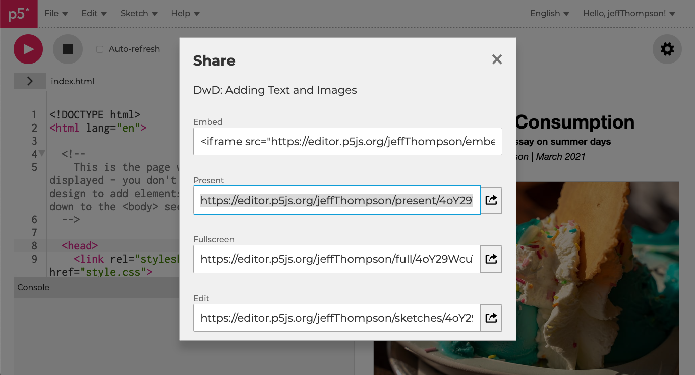

# PART 4: FINISH PROJECT  

### TLDR  
* ⚠️ Due Monday, April 12 by 11am EST ⚠️  
* [Finish your project](#finish-your-project)  
* [Publish data on Sheets](#publish-data-on-sheets)  
* [Turning everything in](#turning-everything-in)  

***

### FINISH YOUR PROJECT  
Having received some feedback on your prototypes, this week you should wrap up your visualizations and add contextual elements to your project's page.

At a minimum, this should include:  
* A project title  
* Byline with your name  
* Text that weaves together your visualizations and helps us understand your project and data's context  
* List in the footer with link to your published data (see below) and the original sources  

You can certainly also include images, static graphics you create, videos, and any other elements you want.

***

### PUBLISH DATA ON SHEETS  
With your project done, publish your data to Google Sheets like with the previous assignment. If you're working with data that's not in `csv` format (like `json`, for example) you can upload them to Google Drive instead.

Be sure to include a link to your data in the `Sources` section of your project!

***

### TURNING EVERYTHING IN  
When you're done, go to `File → Share...` and copy the `Present` link (this opens your project outside the editor with no extra stuff onscreen).

Upload the URL to Canvas – that's it!

