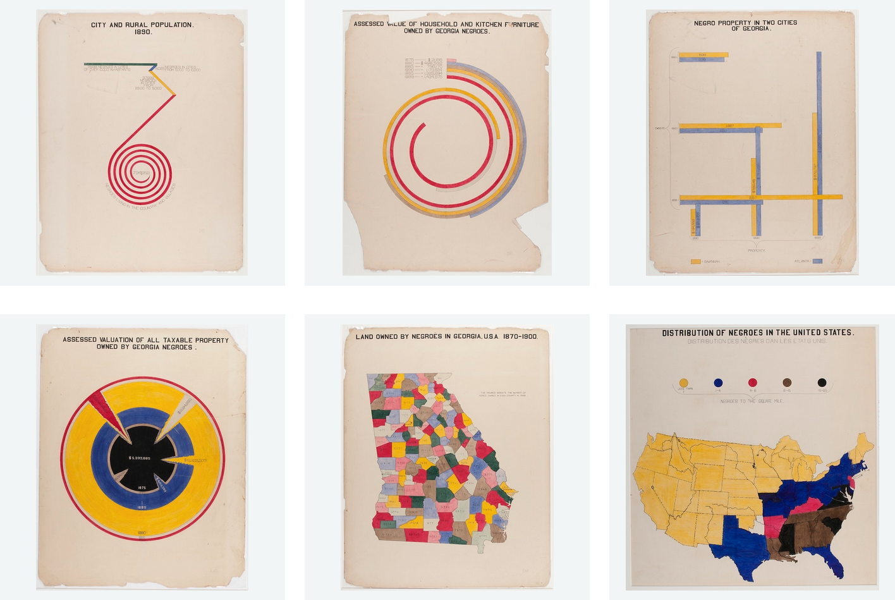

# RACE IN AMERICA

### TLDR  
* Due April 14  
  * For March 10: [contextualization readings, research rabbit hole](Part1-ContextualizationResearch.md)  
  * **March 17: spring break, no class!**  
  * For March 24: [narrow topic, find at least one dataset and one human story, read *Continue, Pivot, or Put It Down*](Part2-FindDataAndAStory.md)  
  * For March 31: [prototypes](Part3-Prototypes.md)  
  * For April 7: [refined prototypes](Part4-RefinedPrototypes.md)  
  * For April 14: [finish project](Part5-FinishProject.md), start thinking about `Final Project` ideas  
* Create a printed zine that includes at least three visualizations on the topic of race in America  
* Should include contextual information like text, quotes, images, illustrations, too  

⚠️ Since this is a multi-week project, details for each week are in separate files! Links in the `TLDR` section above ⚠️ 

***

> “Ours is not the struggle of one day, one week, or one year... Ours is the struggle of a lifetime, or maybe even many lifetimes, and each one of us in every generation must do our part.” – [Congressperson John Lewis](https://en.wikipedia.org/wiki/John_Lewis)

### ASSIGNMENT  
For our next assignment, we will investigate another important, wide-ranging issue: race in America. We'll dig deeper into contextual research, find data to explore, and create a multi-part visualization that tells a small part of this complex story. The potential approaches here are vast: current issues like the disproportionate killing of Black people by the police and ensuing protests over the past few years or anti-Asian violence during the pandemic; historical movements for racial justice; borders and immigration law; Jim Crow laws and other discriminatory policies; the uneven impact of climate change on communinities of color... this barely scratches the surface. [Intersectionality](https://en.wikipedia.org/wiki/Intersectionality) expands this even further, showing us the myriad ways that race connects with other aspects of identity like gender, class, sexuality, and disability.

Data visualization has played an important role when discussing race in America. [Ida B. Wells](https://en.wikipedia.org/wiki/Ida_B._Wells), born enslaved in 1862, began a national anti-lynching campaign when mobs lynched three of her friends and destroyed her press. Her book [*A Red Record*](https://www.visitthecapitol.gov/exhibitions/artifact/red-record-tabulated-statistics-and-alleged-causes-lynchings-united-states) was the first to collect nation-wide data about lynching. In the late 1800s, [W.E.B. Du Bois created over 60 hand-drawn visualizations](https://hyperallergic.com/306559/w-e-b-du-boiss-modernist-data-visualizations-of-black-life) showing topics ranging from the routes of slave trade to Georgia, the number of Black students in different school courses, and the monetary value of Black-owned property. Of course, visualization hasn't always played a positive role. For hundreds of years, we have used [photographs and diagrams to make false claims](https://publicdomainreview.org/essay/the-anthropometric-detective-and-his-racial-clues) about intelligence and other traits based on physical appearance. There is also a long history of redrawing maps to move Native people from their land and gerrymander voting districts to suppress minority voting. Data visualization also helps us see where data isn't recorded: for example, police departments in the U.S. aren't required to report fatal police shootings, making it tremendously difficult to understand the scope of the problem (though some [amazing efforts have been made to do so](https://www.washingtonpost.com/graphics/investigations/police-shootings-database)).

We'll start with contextual research: reading and researching possible topics, as well as finding data that can be sources for stories to tell. This research thread will continue as we create prototypes, refine them, and realize finished projects. We'll also look at how to weave together multiple visualizations with other elements to tell complex stories, ultimately resulting in printed "data zines."

Your project will have a few key components:  
* Use any kind of data, visualized with Illustrator and/or other tools as you see fit  
* Include at least three separate visualizations as well as text, quotes, images, video, etc that weave a story about your topic  
* A printed and bound "data zine"  
* Published data with citations to the original sources  

*Above: a collection of some of the hand-drawn visualizations by W.E.B. Du Bois from his "Data Portraits" project, circa 1900*

***

### A NOTE  
For many Americans, racism and the accompanying issues of discrimination, uneven laws and their enforcement, police violence, and other harms are a daily reality. For others, the killing of George Floyd, Breonna Taylor, Michael Brown, and [many, many others](https://sayevery.name/) sparked a new or renewed call for racial justice. When we talk about "race in America" this doesn't necessarily mean racism, though the two are intertwined more often than not. 

Race is seen today as a human construction, deeply problematic and often connected to related terms like *people* or *communities*, ultimately forming personal or cultural identity. And, while it is an important focus at the moment, "race" refers not just to Black Americans or even [people of color](https://en.wikipedia.org/wiki/Person_of_color) but all Americans. It's also worth noting that [race is a human construction and has no basis in biology](https://www.vox.com/2014/10/10/6943461/race-social-construct-origins-census) but that doesn't prevent it from being a very real force in our society. This complex term, which has overlap with ideas like ethnicity and culture, is all the more reason for us to spend time digging deep into this topic.

The title of this assignment uses the word ["America,"](https://en.wikipedia.org/wiki/American_(word)) also an intentionally broad term. While many people in the USA call our country America and its people Americans, the term more broadly refers to [anyone living in or from North or South America](https://en.wikipedia.org/wiki/Americas).

As we work on this project, you may find these conversations difficult, but that's what makes it important. Over the next few weeks, I ask you to be honest; to listen to each other, the voices you read, and your research; and to give yourself mental space to process, try to understand, and re-present the data and stories you find. If at any point in our conversations you need to take a beat, please do so. And if you have suggestions for making this conversation or assignment better, don't hesitate to send me a note or speak up during class.

***

### INSPIRATION   
* [W.E.B. Du Bois' *Data Portraits*](https://publicdomainreview.org/collection/w-e-b-du-bois-hand-drawn-infographics-of-african-american-life-1900) ([read more about the project](https://hyperallergic.com/306559/w-e-b-du-boiss-modernist-data-visualizations-of-black-life))  
* [*Lynching in America*](https://lynchinginamerica.eji.org/explore) from the Equal Justice Initiative ([read more about the project here](https://hyperallergic.com/385406/lynching-in-america-online-interactive))  
* Lots of projects around police and gun deaths:  
  * [*U.S. Gun Deaths*](https://guns.periscopic.com) by Periscopic  
  * [*Fatal Force*](https://www.washingtonpost.com/graphics/2018/national/police-shootings-2018/?utm_term=.3126be797490) from the Washington Post  
  * [*Mapping Police Violence*](https://mappingpoliceviolence.org) by Samuel Singyangwe, DeRay McKesson, and Johnetta Elzie  
  * [*Gun Deaths in America*](https://fivethirtyeight.com/features/gun-deaths) by Ben Casselman, Matthew Conlen, and Reuben Fischer-Baum  
  * [*1.5 Million Missing Black Men*](https://www.nytimes.com/interactive/2015/04/20/upshot/missing-black-men.html) by Justin Wolfers, David Leonhardt, and Kevin Quealy  
* [Simple, effective graphic](https://twitter.com/melissaforpa/status/1353349448403976192?s=11) from Melissa Shusterman on Kamala Harris as vice president  
* [*Transatlantic Slave Trade in Two Minutes*](https://www.openculture.com/2016/06/the-atlantic-slave-trade-visualized-in-two-minutes.html) by Stephanie Nicole  
* [Visualization of a speech by Martin Luther King Jr](https://www.brainpickings.org/2013/08/28/nancy-duarte-mlk-speech) by Nancy Duarte  
* Lots of visualizations from the exhibition [*Who We Are: New York City by the Numbers*](https://www.mcny.org/story/art-data) ([more on the show](https://www.mcny.org/exhibition/who-we-are))  
* [*16 Maps That Americans Don't Like To Talk About*](https://www.vox.com/2015/5/27/8618261/america-maps-truths) from Vox  
* [Amazing collection of "persuasive maps"](https://digital.library.cornell.edu/?f%5Bcollection_tesim%5D%5B%5D=Persuasive+Maps%3A+PJ+Mode+Collection&per_page=50&sort=latest_date_isi+asc%2C+title_tesi+asc&view=gallery) from Cornell University  

***

### RESOURCES  
* Some further historical reading:  
  * [*Race in US History*](https://www.facinghistory.org/topics/race-us-history) from Facing History and Ourselves  
  * [*A History of Race and Racism in America, in 24 Chapters*](https://www.hsph.harvard.edu/diversity/sph-symposium/a-history-of-race-and-racism-in-america-in-24-chapters) by Ibram X. Kendi/Harvard University  
  * [*158 Resources to Understand Racism in America*](https://www.smithsonianmag.com/history/158-resources-understanding-systemic-racism-america-180975029) from the Smithsonian  
* [An interesting thread from @FrankElavsky](https://twitter.com/frankelavsky/status/1351311898428362754?s=11) on "disability, race, and patriarchy in data visualization"

***

### DATA SOURCES  
* [Tons of datasets](https://www.pewresearch.org/download-datasets) from the Pew Research Center  
* [US Census Bureau data](https://data.census.gov/cedsci) (more [here too](https://www.census.gov/data/tables.html))  
* [Police use of force in New Jersey](https://www.nj.com/news/2018/11/see_how_often_nj_police_punch_kick_or_use_other_fo.html)  
* [Names of 1.8-million emancipated slaves](https://www.openculture.com/2020/01/the-names-of-1-8-million-emancipated-slaves-are-now-searchable-in-the-worlds-largest-genealogical-database-helping-african-americans-find-lost-ancestors.html)  
* [Library of Congress' historical American newspapers collection](https://chroniclingamerica.loc.gov/about/api)  
* [Impact of COVID-19 on Black communities](https://d4bl.org/covid19-data.html) from Data for Black Lives  
* [Historical lynching data](https://plaintalkhistory.com/monroeandflorencework/extras/download.html) collected by Monroe and Florence Work  
* Many of the projects listed above also have links to their data and sources  
* And lots of the data sources listed in the previous assignment will have data related to this project too!

