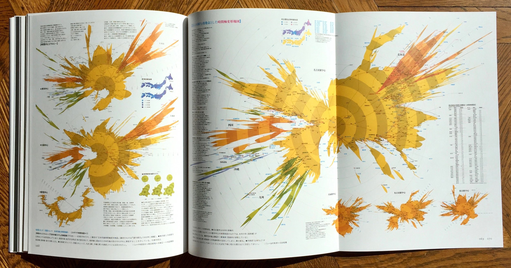

# FINAL PROJECT

### TLDR  
* Create a project that visualizes data using any media and approach  
* [For April 19](Part1-ProjectPitches.md): project pitches  
* [For April 26](Part2-FindDataAndExploratoryVisualizations.md): find data, exploratory visualizations  
* [For May 3](Part3And4-WorkInProgress.md): work in progress  
* [For May 10](Part3And4-WorkInProgress.md): further work in progress  
* For May 12, 8–11am EST (exam period): finish project, final critique  

⚠️ Since this is a multi-week project, details for each week are in separate files! Links in the `TLDR` section above ⚠️ 

***

### ASSIGNMENT
Our last assignment is wide open: make something that visualizes data! The topic, approach, and tools you use are up to you but should be something that you're excited to spend the next four weeks working on. Your goal should be a polished project that both challenges you and uses the things you've learned so far, and is hopefully something refined enough that you're excited to put in your portfolio. (Or, on the other hand, something so weird and experimental that it fails spectacularly but, in doing so, is also amazing and could go into your portfolio!)

If you want to continue to use `chart.js` or other code-based tools, that's great! But if you prefer to use tools like Illustrator to create infographics (see `Inspiration` below) that's another good option. Books, posters, websites, sculptures, data sonification – anything! You're also welcome to explore more unconventional ways of showing data, like we started the semester with.

Note! Our final critique will be during our exam time, which hasn't been announced yet. I'll let you know when that is set, but please don't make any plans until we know when the crit will be.

*Above: "Experiments in Time Distance Map" by Kohei Sugiura, circa 1960s*

***

### INSPIRATION  
* Infographics (often a mix of code-based visualizations and illustrations, photographs, etc)  
  * [The Guardian](https://www.theguardian.com/interactive)  
  * [New York Times](https://www.nytimes.com/section/upshot)
  * [Washington Post](https://twitter.com/PostGraphics)  
* More examples in the `Images` folder  

