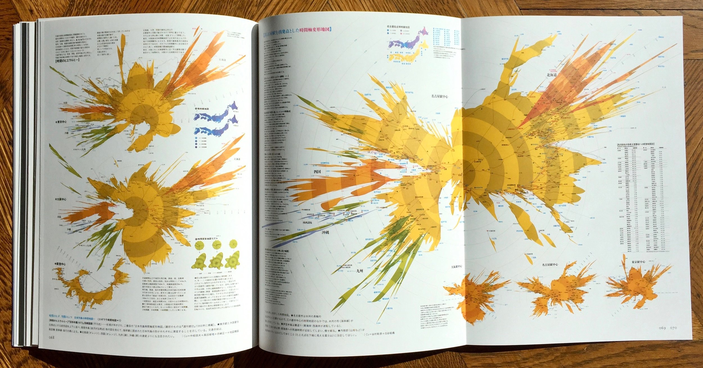

# FINAL PROJECT

### TLDR  
* Create a project that visualizes data using any media and approach  
* For April 14: [project pitches](Part1-ProjectPitches.md) (and finish your zine)  
* For April 21: [find data, exploratory visualizations](Part2-FindDataAndExploratoryVisualizations.md)  
* For April 28: [work in progress](Part3-WorkInProgress.md)  
* For May 11, 9–11am: [finish project](Part4-FinishYourProject.md), final critique  

⚠️ Since this is a multi-week project, details for each week are in separate files! Links in the `TLDR` section above ⚠️ 

***

### ASSIGNMENT
Our last assignment is wide open: make something that visualizes data! The topic, approach, and tools you use are up to you but should be something that you're excited to spend the next four weeks working on. Your goal should be a polished project that both challenges you and uses the things you've learned so far, and is hopefully something refined enough that you're excited to put in your portfolio. (Or, on the other hand, something so weird and experimental that it fails spectacularly but, in doing so, is also amazing and could go into your portfolio!)

If you want to continue to use the tools we've covered so far, that's great! But if you prefer to use tools like `chart.js` to create infographics (see `Inspiration` below) that's another good option. Books, posters, explainer videos, websites, sculptures, data sonification – anything! You're also welcome to explore more unconventional and/or analog ways of showing data, like we started the semester with.

*Above: "Experiments in Time Distance Map" by Kohei Sugiura, circa 1960s*

***

### INSPIRATION  
* Infographics (often a mix of code-based visualizations and illustrations, photographs, etc)  
  * [The Guardian](https://www.theguardian.com/interactive)  
  * [New York Times](https://www.nytimes.com/section/upshot)
  * [Washington Post](https://twitter.com/PostGraphics)  
* More examples in the `Images` folder  

